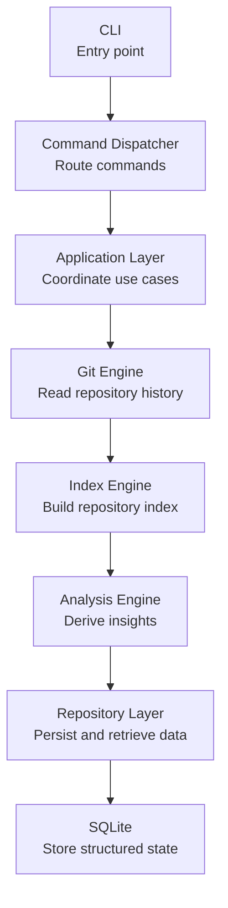

```mermaid
flowchart TB
    CLI[CLI\nEntry point]
    CD[Command Dispatcher\nRoute commands]
    AL[Application Layer\nCoordinate use cases]
    GE[Git Engine\nRead repository history]
    IE[Index Engine\nBuild repository index]
    AE[Analysis Engine\nDerive insights]
    RL[Repository Layer\nPersist and retrieve data]
    DB[SQLite\nStore structured state]

    CLI --> CD --> AL --> GE --> IE --> AE --> RL --> DB
```